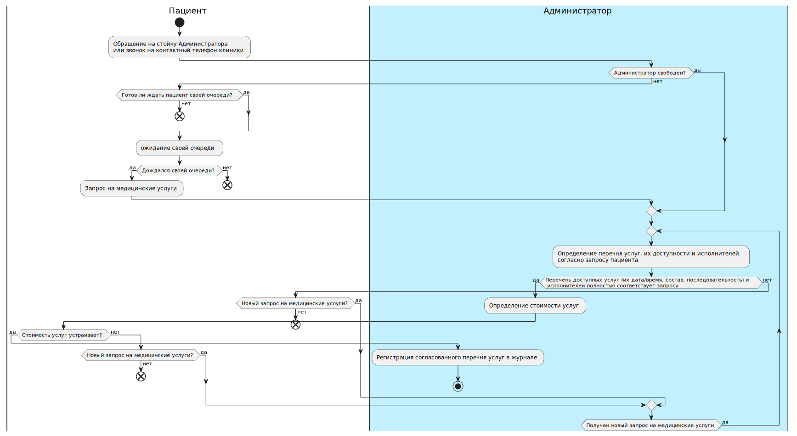
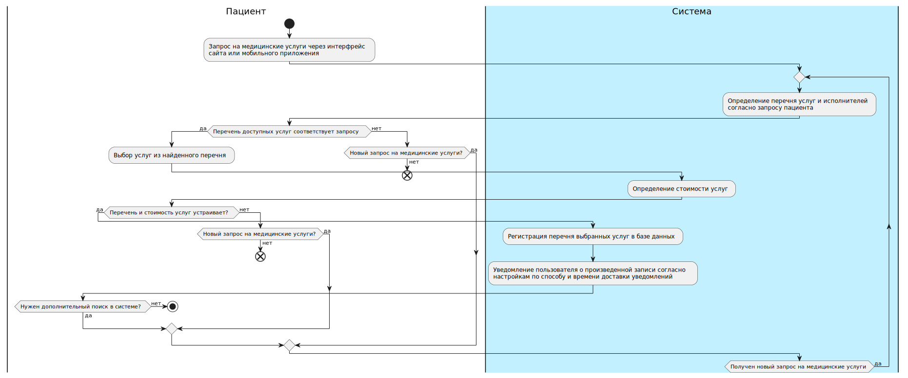
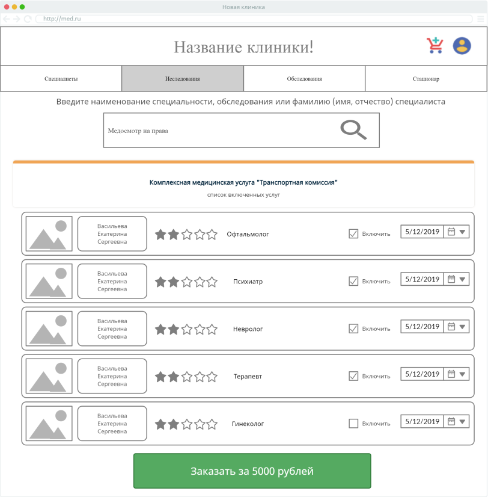
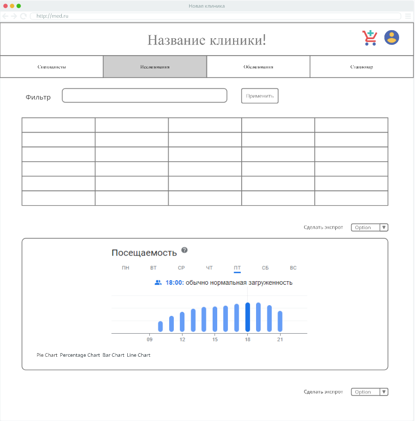

# Тестовое задание (запись пациентов в частной клинике)

[Текст тестового задания](./test.docx)

## Бизнес требования:

### Проблематика:

В частной клинике запись пациентов к врачам производится администратором путем регистрации в журнале через прием заявок:

- по телефону
- по личному обращению пациента

данный процесс не автоматизирован, что проводит к влиянию на него различных факторов и, как следствие, неэффективной работе клиники, уходу пациентов к конкурентам и высокому показателю упущенной выгоды

### Текущий алгоритм:

На диаграмме деятельности (UML), приведенной ниже представлен текущий процесс записи пациентов:

При обращении в клинику по телефону или лично пациент может попасть на очередь и соответствующее ей ожидание. В случае, если пациент дождался своей очереди он формулирует запрос администратору на необходимые ему медицинские услуги с указанием удобных для него даты/времени и возможно пожелания попасть к определенному специалисту(ам). В случае, если запрос пациента полностью совпадает с возможностью клиники администратор производит расчет стоимости услуг и согласует запись с пациентом. При согласии последнего администратор производит регистрацию записи в журнале.

Факторы несовершенства существующей системы записи пациентов:

- отсутствие автоматизации процесса планирования работы медицинского персонала
- отсутствие прозрачной системы анализа различных показателей работы клиники по потоку пациентов, загрузке отделений клиники, финансовым показателям отделений
- отсутствие возможности распараллелить процесс записи между несколькими администраторами ввиду регистрации в журнале
- возможность занятости/отсутствия администратора в момент обращения клиента
- отсутствие автоматизации уведомлений клиентов о предстоящем приеме/обследовании/медицинском осмотре/госпитализации или их переносе/отмене

Человеческий фактор и его влияние на процесс записи (последующего уведомления о записи) как со стороны клиента, так и со стороны администратора:

- незнание администратором всех нюансов оказания медицинских услуг, их состава, маршрутов (последовательности) и тарификации (особенно при комплексных услугах: медицинском осмотре, госпитализации и т.п.)
- незнание администратором всех нюансов расписания работы медицинского персонала (включая больничные, отгулы, отпуска, трудоустройства/увольнения)
- возможные ошибки со стороны администратора при планировании работы медицинского персонала (заполнении журнала)
- возможные ошибки со стороны администратора при регистрации записи в журнале
- "глухой телефон" между пациентом и администратором
- возможные ошибки со стороны клиента при записи даты и времени оказания медицинских услуг, а также при записи возможных рекомендаций по подготовке к ним
- забывчивость клиента
- возможные ошибки со стороны администратора при уведомлении клиентов о предстоящем приеме/обследовании/медицинском осмотре/госпитализации или их переносе/отмене

### Цель:

автоматизация процесса записи пациентов к врачам в указанной клинике с целью повышения удобства записи/уведомления клиентов, минимизации человеческого фактора, оптимизации нагрузки медицинского персонала, получения автоматизированного доступа к различным видам отчетности и ее визуализации, повышения эффективности работы клиники в целом.

### Задачи:

1. необходимо произвести сбор пожеланий и требований представителей клиники к будущей информационной системе
2. необходимо произвести анализ нормативной базы клиники, в части, касающейся автоматизируемого процесса
3. необходимо произвести анализ работающих в клинике информационных систем, их программных интерфейсов (API), в части, касающейся автоматизируемого процесса
4. после выполнения вышеперечисленных пунктов, анализа требований к будущей информационной системе, рынка решений, возможного объема работ и финансирования, а также состава и компетенций команды необходимо сделать выбор в пользу готового продукта (no-code), платформы (low-code) или фреймворка (code)
5. в зависимости от выбора, сделанного в вышеуказанном пункте, необходимо составить техническое задание на разработку и/или внедрение  информационной системы, определив конкретные функциональные требования, перечень, объем, план и график работ на разработку и/или внедрение информационной системы, ее поддержку и развитие
6. на основе технического задания реализовать разработку и/или внедрение информационной системы, интеграцию со смежными информационными системами клиники
7. в зависимости от необходимости и объема возможного финансирования организовать процесс поддержки и развития разработанной/внедренной информационной системы

## Возможные функциональные требования:

### Пользователи системы:

- пациенты (как потенциальные клиенты клиники, так и действующие; активные пользователи ПК и/или мобильных устройств)
- администраторы (медицинские регистраторы)
- медицинский персонал:
  - высший (врачи)
  - средний (медсестра (медбрат), зубной врач, зубной техник, оптометрист, лаборант, физиотерапевт, рентгенолог, диетолог и т. п.)
  - младший (младшая медсестра (младший медбрат), санитар, санитарка)
- руководство клиники (директор, главный врач, главный бухгалтер)

### Возможности системы:

- сбор и учет контактов (номер телефона и имя) потенциальных пациентов для обратной связи (интеграция с сайтом, с мобильным приложением клиники)
- учет персональных данных пациентов с дополнительной возможностью редактирования контактных данных пациентов через личный кабинет сайта или мобильного приложения клиники (интеграция с сайтом/мобильным приложением клиники)
- учет кадровой информации по медицинскому персоналу клиники в рамках автоматизируемого процесса (график работы с учетом больничных, отгулов, отпусков, трудоустройств/увольнений; интеграция с программным обеспечением учета кадровой информации)
- создание/редактирование состава и маршрутов для простых и комплексных медицинских услуг: медицинские осмотры, госпитализации и т.п.
- запись пациентов клиники на прием/обследование/медицинский осмотр/госпитализацию как с помощью системы, так и через сайт или мобильное приложение клиники (интеграция с сайтом/мобильным приложением клиники) с возможностью редактирования/отмены произведенных записей
- уведомления пациентов о предстоящем приёме, изменении даты/времени приема или его отмене, а также их настройка по способу и времени доставки
- создание и экспорт заключений, медицинских анализов, справок, выписных эпикризов и т.п. (медицинская документация)
- планирование расписания медицинского персонала на текущий (прошедший(ие)/последующий(ие)) рабочий день/дни;
- заказ, формирование и экспорт различных справок и выписок (немедицинская документация)
- формирование и экспорт различной отчетности (в том числе по финансовым показателям; интеграция с программным обеспечением бухгалтерского учета) в текстовом, табличном и графическом представлении.

### Основные роли в системе:

| Роль в системе       | Доступные действия в системе                                 |
| :------------------- | ------------------------------------------------------------ |
| пациент (аноним)     | отсутствуют (доступна форма для обратного звонка (номер телефона и имя) на сайте и в мобильном приложении) |
| пациент              | <ul><li>просмотр/редактирование персональных данных и настройка уведомлений из личного кабинета;</li><li>запись на прием/обследование/медицинский осмотр;</li><li>просмотр/редактирование/отмена записей пациентов на прием/обследование/медицинский осмотр/госпитализацию (только просмотр/отмена);</li><li>просмотр/экспорт заключений, результатов анализов, выписных эпикризов и т.п.;</li><li>заказ различных справок и выписок.</li></ul>Перечисленные действия осуществляются пациентом через интерфейс сайта или мобильного приложения клиники|
| администратор        | <ul><li>просмотр/редактирование персональных данных пациентов и настройка уведомлений пациентов;</li><li>запись на прием/обследование/медицинский осмотр/госпитализацию;</li><li>просмотр/редактирование/отмена записей пациентов на прием/обследование/медицинский осмотр/госпитализацию;</li><li>просмотр/экспорт заключений, результатов анализов, выписных эпикризов и т.п.;</li><li>формирование/просмотр/редактирование/экспорт различных справок и выписок </li></ul>|
| медицинский персонал | <ul><li>просмотр персональных данных пациентов;</li><li>просмотр записей пациентов на прием/обследование/медицинский осмотр/госпитализацию;</li><li>запись/редактирование простых и комплексных медицинских услуг (их состава и маршрутов);</li><li>запись/просмотр/редактирование/экспорт заключений, результатов анализов, справок, выписных эпикризов и т.п.;</li><li>просмотр/экспорт расписания на текущий (прошедший(ие)/последующий(ие)) рабочий день/дни.</li></ul>Текущий состав доступных действий различен для высшего, среднего и младшего медицинского персонала. |
| руководство клиники  | <ul><li>просмотр персональных данных пациентов;</li><li>просмотр записей пациентов на прием/обследование/медицинский осмотр/госпитализацию;</li><li>запись/просмотр/редактирование/экспорт заключений, результатов анализов, справок, выписных эпикризов и т.п.;</li><li>формирование/просмотр/редактирование/экспорт различных справок и выписок;</li><li>просмотр/экспорт расписания медицинского персонала на текущий (прошедший(ие)/последующий(ие)) рабочий день/дни;</li><li>запись/редактирование простых и комплексных медицинских услуг (их состава, маршрутов и тарификации);</li><li>формирование/просмотр/экспорт различной отчетности в текстовом, табличном и графическом представлении.</li></ul>Текущий состав доступных действий различен для директора, главного врача и главного бухгалтера. |

На диаграмме деятельности (UML), приведенной ниже представлен процесс записи пациентов после автоматизации:

Запись на прием/обследование/медицинский осмотр пациент осуществляет через интерфейс сайта или приложения клиники. Пациент формирует запрос(ы) в поисковой форме и по результатам поиска пациент выбирает необходимые медицинские услуги. При согласии пациента с перечнем выбранных услуг и их стоимостью он производит формирование заказа и система производит регистрацию перечня выбранных услуг в базе данных системы. При этом у пациента остается возможность обратиться лично или по телефону для записи на прием/обследование/медицинский осмотр, в этом случае запись в системе производит администратор.

Интерфейс отчетности предусмотрен в виде табличных данных с фильтрацией, сортировкой и группировкой по имеющимся параметрам. На основе указанных табличных данных динамически формируются различные диаграммы. Возможно произвести экспорт как табличных данных в форматах xls, csv, так и диаграмм в форматах svg, png. Основные данные для отчетов касаются финансовых показателей клиники:

- поток пациентов (статистика за день, неделю, месяц, год с основным показателем по количеству пациентов и сегментацией по времени/дню недели/дате/месяцу/году, а также возрасту пациентов)

- загрузка отделений клиники (статистика за день, неделю, месяц, год с основным показателем по соотношению количества пациентов к количеству медицинского персонала и сегментацией по времени/дню недели/дате/месяцу)

- загрузка медицинского персонала (статистика за день, неделю, месяц, год с основным показателем по количеству пациентов и сегментацией по месяцу/кварталу)

- финансовая отдача отделений (статистика за день, неделю, месяц, год с основным показателем по соотношению прибыли к количеству медицинского персонала и сегментацией по дню недели/дате/месяцу/году)

Помимо формирования вышеперечисленных отчетов возможно предусмотреть отчетность по качеству обслуживания по отделениям в целом и по каждому работнику в частности на основе 5-ти бальной системы отзывов пациентов.

